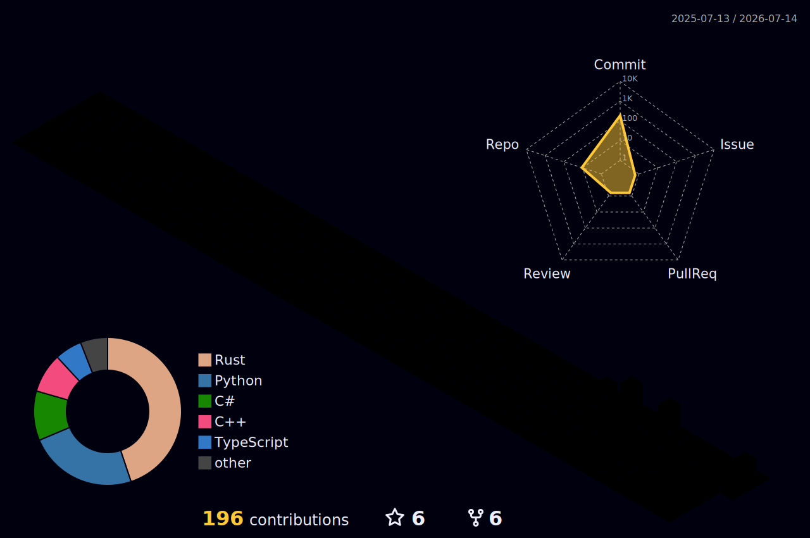

<!-- FUTURISTIC CYBERPUNK HEADER BANNER -->

  

<!-- DYNAMIC TYPING SVG & GREETING -->
<h1 align="center">Hi there! I'm indoctrinatedrecluse 👋</h1>

  

  

  <strong>💫 A curious mind decoding complex systems, building elegant solutions, and exploring the frontiers of software. 💫</strong>

<!-- GITHUB STATS DASHBOARD GRID -->
<h2 align="center">📊 GitHub Stats Dashboard</h2>

  
  

  

<h3 align="center">📈 Commit Frequencies & Activity Graph</h3>

  

<!-- 3D CONTRIBUTION CALENDAR -->
<!-- This section renders the 3D contribution graph SVG generated by our daily GitHub Action -->
<h2 align="center">🌌 3D Contribution Calendar</h2>

  

  Generated automatically daily using GitHub Actions.

<!-- SKILLS & TECHNOLOGIES -->
<h2 align="center">💻 Tech Stack & Toolkit</h2>

<h3 align="center">Languages</h3>

  
  
  
  
  
  

<h3 align="center">Frameworks & Technologies</h3>

  
  
  
  

<h3 align="center">Infrastructure & Tools</h3>

  
  
  
  

<!-- CONNECT WITH ME -->
<h2 align="center">🤝 Connect with Me</h2>

  
  
  

<!-- FOOTER -->

  Designed with 💜 by Antigravity

