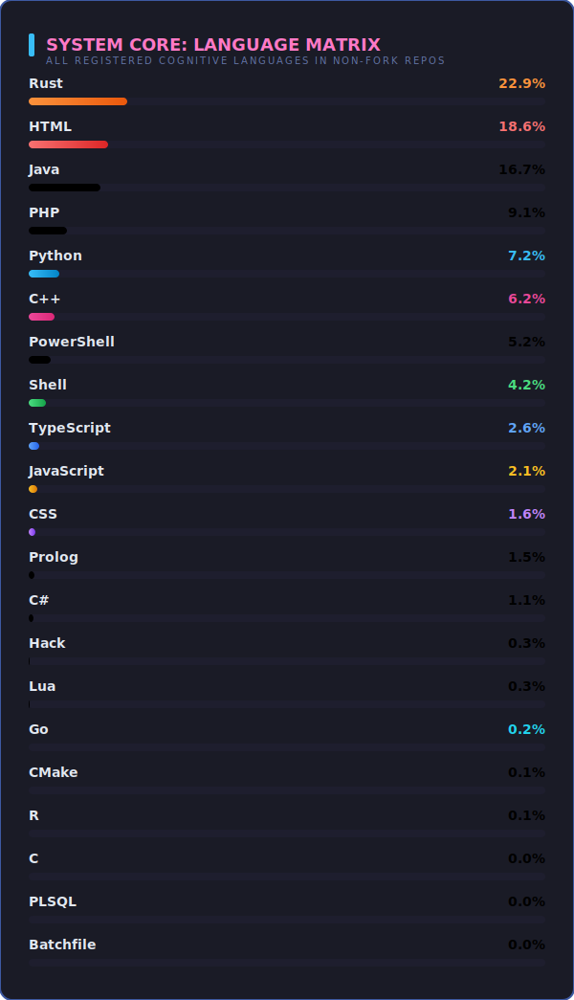

<!-- FUTURISTIC CYBERPUNK HEADER BANNER -->

  

<!-- DYNAMIC TYPING SVG & GREETING -->
<h1 align="center">Hi there! I'm indoctrinatedrecluse 👋</h1>

  

  

<!-- SECTION DIVIDER -->

  

<!-- ABOUT ME SECTION -->
<h2 align="center">🌌 System Log: About Me</h2>

  🤖 <b>Developer</b> &nbsp;|&nbsp; 💻 <b>Problem Solver</b> &nbsp;|&nbsp; 🌌 <b>Tech Explorer</b>

  <i>A curious mind decoding complex systems, building elegant solutions, and exploring the frontiers of software.</i>

<!-- SECTION DIVIDER -->

  

<!-- GITHUB STATS DASHBOARD GRID -->
<h2 align="center">📊 GitHub Stats Dashboard</h2>

  
  

<h3 align="center">📈 Commit Frequencies & Activity Graph</h3>

  

<!-- SECTION DIVIDER -->

  

<!-- SNAKE CONTRIBUTION GAME -->
<h2 align="center">🐍 Snake Contribution Matrix</h2>

  <picture>
    <source media="(prefers-color-scheme: dark)" srcset="./profile-3d-contrib/github-contribution-grid-snake-dark.svg" />
    
  </picture>

<!-- SECTION DIVIDER -->

  

<!-- 3D CONTRIBUTION CALENDAR -->
<h2 align="center">🌌 3D Contribution Calendar</h2>

  

  Generated automatically daily using GitHub Actions.

<!-- SECTION DIVIDER -->

  

<!-- CUSTOM LANGUAGE MATRIX -->
<h2 align="center">💻 System Core: Language Matrix</h2>

  

<!-- SECTION DIVIDER -->

  

<!-- SKILLS & TECHNOLOGIES -->
<h2 align="center">🛠️ Tech Stack & Toolkit</h2>

<h3 align="center">Languages</h3>

  
  
  
  
  
  
</path>

<h3 align="center">Frameworks & Technologies</h3>

  
  
  
  

<h3 align="center">Infrastructure & Tools</h3>

  
  
  
  

<!-- SECTION DIVIDER -->

  

<!-- CONNECT WITH ME -->
<h2 align="center">🤝 Connect with Me</h2>

  
  
  

<!-- SECTION DIVIDER -->

  

<!-- FOOTER -->

  Designed with 💜 by Antigravity

